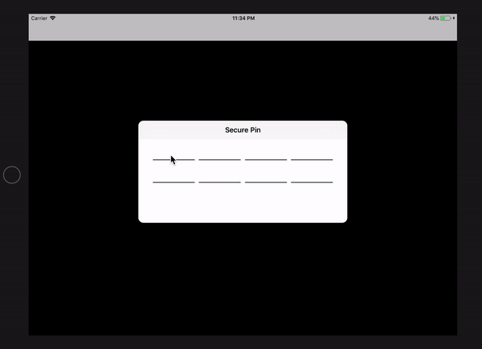

# PKSecurePin
Elegant Secure PIN with 4 digits in Swift

[](https://developer.apple.com/iphone/index.action)
[](https://developer.apple.com/swift)
[](http://mit-license.org)

**Feature:**
* Ease to use
* 4 digit pin input with confirm pin input
* Accept only numeric digit as input
* 1 numeric digit length for each input
* Auto jump to immediate next input on every insertion
* Auto jump to immediate previous input on every deletion
* Disallow to chose any input manually



# Installation
### CocoaPods
In your `Podfile`:
```
pod "PKSecurePin"
```

# Usage
```swift
       
        // create an instance of PKSecurePinViewController
        let pinViewC  = PKSecurePinViewController.init()
        
       // create the navigation controller
        let pinNav = UINavigationController(rootViewController: pinViewC)        
        pinNav.modalPresentationStyle = .popover

        //pinview controller position
        pinViewC.preferredContentSize = CGSize(width: 500, height: 200)
        
        // create an instance for popover
        let popover = pinNav.popoverPresentationController
        popover?.permittedArrowDirections = UIPopoverArrowDirection(rawValue: 0)
        popover?.sourceView = self.view

        //popover position
        popover?.sourceRect = CGRect(x: UIScreen.main.bounds.width * 0.5 - 200, 
                                     y: UIScreen.main.bounds.height * 0.5 - 100, 
                                     width: 400, height: 200)
        
        //present the navigation controller
        self.present(pinNav, animated: true, completion: nil)


