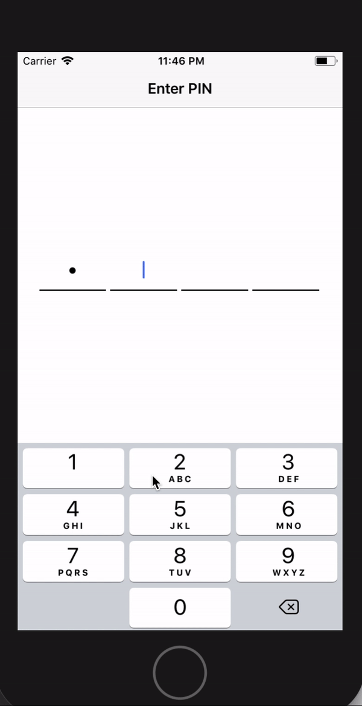

# PKSecurePin
Elegant Secure PIN with 4 digits in Swift

[](https://developer.apple.com/iphone/index.action)
[](https://developer.apple.com/swift)
[](http://mit-license.org)

**Feature:**
* Ease to use
* 4 digit pin input with confirm pin input
* Accept only numeric digit as input
* 1 numeric digit length for each input
* Auto jump to immediate next input on every insertion
* Auto jump to immediate previous input on every deletion
* Disallow to chose any input manually




# Installation
### CocoaPods
In your `Podfile`:
```
pod "PKSecurePin"
```

# Usage
```swift
            // adopt the protocol
            class ViewController: UIViewController, UIPopoverPresentationControllerDelegate, PKSecurePinControllerDelegate
            
            // create an instance of PKSecurePinViewController, with how many PIN, OTP or confirmation, position from top
            var pinViewC = PKSecurePinViewController.init(numberOfPins: 6, withconfirmation: true, topPos: 230)
            
            // PKSecurePinControllerDelegate methods implementation
            func didFinishSecurePin() {
                //show the message if you want to display on success, else comment the below line
                pinViewC.showMessage(PKSecurePinError(errorString:"Success", errorCode: 200, errorIsHidden: false))
            }
            
            // set the background color for PIN controller
            pinViewC.view.backgroundColor = UIColor.white
            
            //set the delegate
            pinViewC.delegate = self

            // create the pin navigation controller
            let pinNav = UINavigationController(rootViewController: pinViewC)

            // set the presentation style
            pinNav.modalPresentationStyle = .popover

            //pinview controller position
            pinViewC.preferredContentSize = CGSize(width: UIScreen.main.bounds.width * 0.5, height: 200)

            // create an instance for popover
            let popover = pinNav.popoverPresentationController
            popover?.permittedArrowDirections = UIPopoverArrowDirection(rawValue: 0)
            popover?.sourceView = self.view

            //popover position
            popover?.sourceRect = CGRect(x: UIScreen.main.bounds.width * 0.5 - UIScreen.main.bounds.width * 0.25, y: UIScreen.main.bounds.height * 0.5 - 100, width: UIScreen.main.bounds.width * 0.5, height: 200)

            //present the pin navigation controller
            self.present(pinNav, animated: true, completion: nil)


